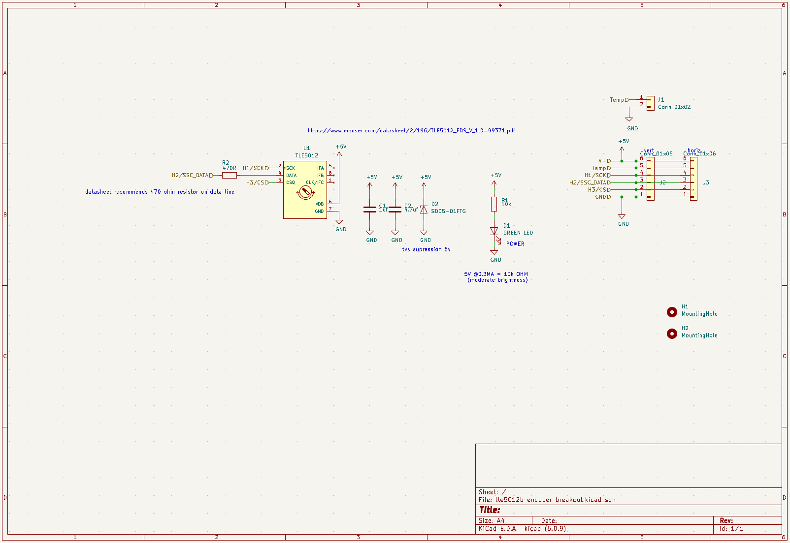

# TLE5012-Hall-Encoder-Module
Breakout/mounting board for the TLE5012 hall encoder to use with the vesc motor controller project.

(Pictures are from my nearly identical as5047 encoder board at https://github.com/Teslafly/AS5047-Hall-Encoder-Module)

# Mounting:
- The mounting holes fit an m3 screw and are 16mm apart center to center.
- If the pcb cannot recess into the motor, a 3d printed shim (file link) can raise the encoder and provide clearance. If the motor gets too hot, the shim may be laser cut or milled out of a more resistant material.
- This encoder works with a diametric magnet fixed to the motor shaft. 
    - The magnet must be centered on the shaft. The encoder must be centered over the center of the magnet.
    - I find good results with a 6x2mm or 6x3mm neodymium magnet placed 1-5mm away from the face of the encoder.
    - Magnet example: https://www.aliexpress.us/item/3256801356246959.html

# Building:
- This pcb can be hand soldered easially.
- You can use either horizontal or vertical jst gh connectors for each connector placement. The vertical data connector should be placed with pins outwards to maintain the same pinout between the horizontal/vertical data connector options.
- As the temperature sensor connector is unpolarised, either horizontal or vertical connector can be placed on the same footprint. see pictures.

# JST GH mating connectors and making cables:
- If you do not have a crimper for JST GH crimps, they are fiddley and are hard to crimp properly.
I recommend either getting a male to male JST GH cable and cutting it to splice into a longer encoder cable, or doing the same with a precrimped silicone wire kit like this:
  - https://www.amazon.com/Pre-Crimped-Connectors-Pixhawk2-Pixracer-Silicone/dp/B07PBHN7TM/
  - Silicone wire is preferred due to it's durability and heat resistance. If you use pvc wire you should reinforce around the male GH connector with silocone rtv.

- The jst gh data connector has the same pinout as the JST PH vesc hall sensor connector.
however, note that some vesc hardwares that have swapped to JST GH connectors have reversed pinouts.
aka the cable must connect pins 1<->6, 2<->5, etc so that the locking clips are reversed from each other.
  - THIS IS NOT THE CASE ON ALL HARDWARES. CHECK YOUR PINOUT BEFORE POWERING.
    A REVERSED PINOUT WILL DESTROY THE ENCODER AS 5V AND GND ARE SWAPPED.
  - (The sensor should get lukewarm during operation. If it gets really hot then it's dead or a wire is shorted)

- Also, your vesc hardware must not have filters placed on the hall port pins. 
these filters must be removed for this encoder to work if present. They are present on all vesc hw 4.2, and nearly all flipsky boards. Trampa hw 6.0+ do not have these filters and will work as is.

### Wire:
I recommend using sheilded wire. usb cable will work in a pinch if you omot the temp wire and use the sheild for gnd. but ~28awg 6 core sheilded cable is ideal. the sheild should be connected to the gnd pin on the vesc side, and unconnected on the sensor side. you must keep all wires close to each other to get good signal integrity when splicing /crimping the end connectors.
If you cannot source sheilded wire, you will get acceptable results by keeping the wires close, and routing the cable away from the phase wires of the motor.
It is recommended that the data cable is kept under 0.5 meters. If that is not possible then sheilded wire must be used and attention to detail excercised in cable construction.

# Testing:
- This sensor runs best at 5V input power. 3.3V operation is not gaurenteed but will not cause damage.
- The led on the pcb should glow somewhat dimly. It is not blindingly bright.
- The sensor IC should get lukewarm during operation. If it gets really hot then it's dead or a wire is shorted

- You can troubleshoot/test the signal integrity of your cable and encoder functionality with the "`encoder`" command in the vesc terminal. 
  - The error rate should be very close to zero.
  - If it is above 0.5% then you should troubleshoot your setup and improve signal integrity. 
  - 99+% generally means that all communication with the encoder has failed. The wiring may be wrong, the sensor dead, or your vesc has hall port filters that need to be removed and shorted.
- when viewing the encoder angle in the vest-tool realtime view, the encoder value should change smoothly through the entire 360 degrees. If it is jumpy you probably have a signal integrity issue
- If the sensor cable is poorly routed/sheilded, high motor currents can cause noise that increases the encoder error rate. If you experience encoder faults during acceleration, check for intermittent opens in all signals and try rerouting the sensor cable away from motor phase wires and battery cables.
- a 3d printable test jig using a 608 bearing and 6mm magnet is included in the "`608 bearing test holder`" folder.
